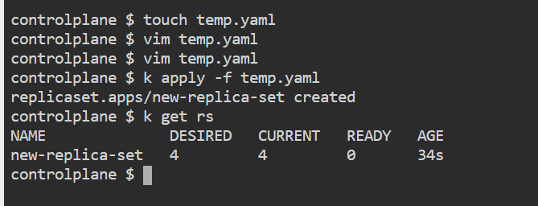
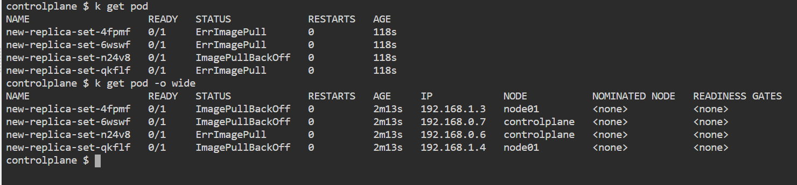
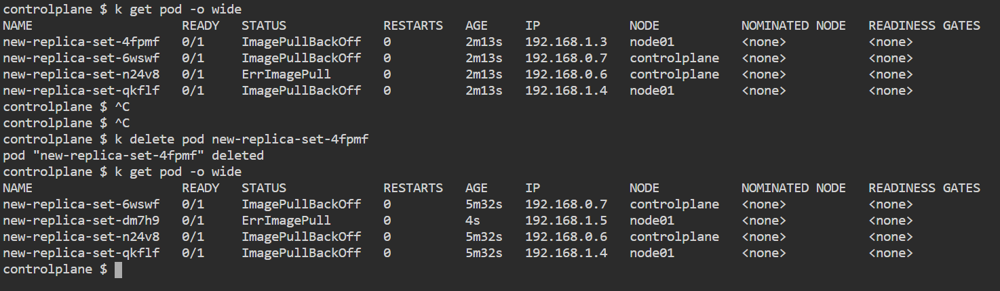

# kubernetes Day1 Lab2

### 1. Create a ReplicaSet using the below yaml

```yaml
apiVersion: apps/v1
kind: ReplicaSet
metadata:
  name: new-replica-set
  namespace: default
spec:
  replicas: 4
  selector:
    matchLabels:
      name: busybox-pod
  template:
    metadata:
      labels:
        name: busybox-pod
    spec:
      containers:
      - command:
        - sh
        - -c
        - echo Hello Kubernetes! && sleep 3600
        image: busybox777
        imagePullPolicy: Always
        name: busybox-container
```



---

### 2. How many PODs are DESIRED in the new-replica-set?

4 pods

---

### 3. What is the image used to create the pods in the new-replica-set?

busybox777

---

### 4. How many PODs are READY in the new-replica-set?

zero



---

### 5. Why do you think the PODs are not ready?

Error Image pull, Image PullBack Off

---

### 6. Delete one of pods, How many pods now?



k delete pod $pod-name

4 pods 

---

### 7. Why are there still 4 PODs, even after you deleted one?

replicas: 4

---

### 8. Create a ReplicaSet using the below yaml

There is an issue with the file, so try to fix it.

```yaml
apiVersion: v1
kind: ReplicaSet
metadata:
  name: replicaset-1
spec:
  replicas: 2
  selector:
    matchLabels:
      tier: frontend
  template:
    metadata:
      labels:
        tier: frontend
    spec:
      containers:
      - name: nginx
        image: nginx
```

First line should be : apiVersion: app/v1
