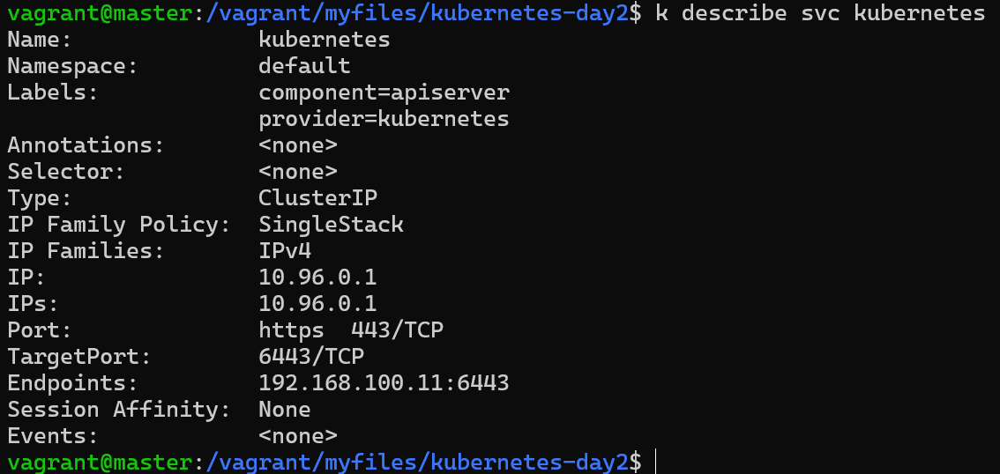

# kubernetes Day2 Lab3
---
## 1. Create a deployment called my-first-deployment of image nginx:alpine in the default namespace.
## Check to make sure the deployment is healthy.

create a yaml file with name nginx-deployment.yaml with following content. 

```yaml
apiVersion: apps/v1
kind: Deployment
metadata:
  name: my-first-deployment
  labels:
    app: nginx
spec:
  replicas: 3
  selector:
    matchLabels:
      app: nginx
  template:
    metadata:
      labels:
        app: nginx
    spec:
      containers:
      - name: nginx
        image: nginx:alpine
        ports:
        - containerPort: 80
```

k apply -f nginx-deployment.yaml
k get deployments


---
## 2. Scale my-first-deployment up to run 3 replicas.
## Check to make sure all 3 replicas are ready.


---
## 3. Scale my-first-deployment down to run 2 replicas.

replicas : 2


---
## 4.Change the image my-first-deployment runs from nginx:alpine to httpd:alpine .


---

## 5.Delete the deployment my-first-deployment


---
## 6.Create deployment from the below yaml

```yaml
apiVersion: apps/v1
kind: Deployment
metadata:
  name: frontend-deployment
  namespace: default
spec:
  replicas: 4
  selector:
    matchLabels:
      name: busybox-pod
  strategy:
    rollingUpdate:
      maxSurge: 25%
      maxUnavailable: 25%
    type: RollingUpdate
  template:
    metadata:
      labels:
        name: busybox-pod
    spec:
      containers:
      - command:
        - sh
        - -c
        - echo Hello Kubernetes! && sleep 3600
        image: busybox888
        imagePullPolicy: Always
        name: busybox-container
```

        
---
## 7.How many ReplicaSets exist on the system now?


only one with front-end name 


---
## 8.How many PODs exist on the system now?

4 pods 


---

## 9.Out of all the existing PODs, how many are ready?
No one ready of them.

---
## 10.What is the image used to create the pods in the new deployment?

busybox888

---

## 11.Why do you think the deployment is not ready?

There is not such an image called busybox888

---
---

# kubernetes Day2 Lab4

---

## 1-How many Services exist on the system
only 1


---

## 2-What is the type of the default kubernetes service?

ClusterIP

---

## 3-What is the targetPort configured on the kubernetes service?

6443/TCP



---
## 4-How many labels are configured on the kubernetes service?

2 labels :
component=apiserver
provider=kubernetes


---

## 5-How many Endpoints are attached on the kubernetes service?
only 1

---

## 6-Create a Deployment using the below yaml
```yaml
apiVersion: apps/v1
kind: Deployment
metadata:
  name: simple-webapp-deployment
  namespace: default
spec:
  replicas: 4
  selector:
    matchLabels:
      name: simple-webapp
  strategy:
    rollingUpdate:
      maxSurge: 25%
      maxUnavailable: 25%
    type: RollingUpdate
  template:
    metadata:
      creationTimestamp: null
      labels:
        name: simple-webapp
    spec:
      containers:
      - image: kodekloud/simple-webapp:red
        imagePullPolicy: IfNotPresent
        name: simple-webapp
        ports:
        - containerPort: 8080
          protocol: TCP
```


---
## 7-What is the image used to create the pods in the deployment?

simple-webapp

---

## 8-Create a new service to access the web application using the the below 

```yaml
Name: webapp-service
Type: NodePort
targetPort: 8080
port: 8080
nodePort: 30080
selector:
  name: simple-webapp
```

```yaml
apiVersion: v1
kind: Service
metadata:
  name: webapp-service
spec:
  Type: NodePort
  selector:
    name: simple-webapp
  ports:
    - protocol: TCP
      port: 8080
      targetPort: 8080
```


---
