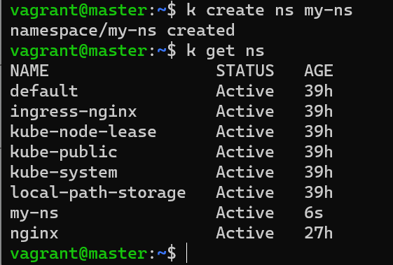
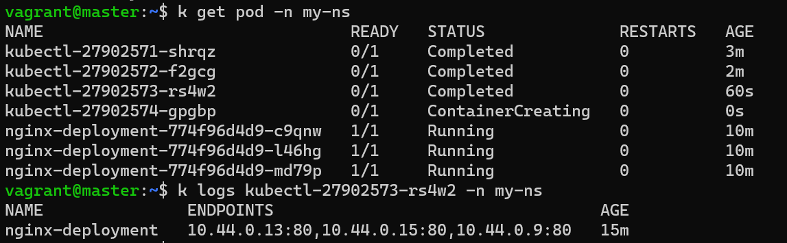
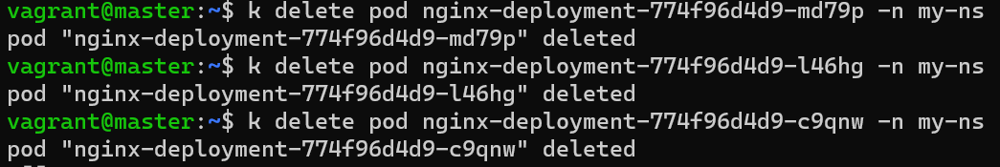
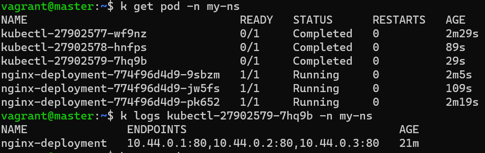

### Create basic resources
- Create the specified Namespace
  
  

- Create a deployment nginx with 3 replicas
  ```yaml
  apiVersion: apps/v1
  kind: Deployment
  metadata:
    name: nginx-deployment
    namespace: my-ns
    labels:
      app: nginx
  spec:
    replicas: 3
    selector:
      matchLabels:
        app: nginx
    template:
      metadata:
        labels:
          app: nginx
      spec:
        containers:
        - name: nginx
          image: nginx:alpine
          ports:
          - containerPort: 80

  ```

- Expose the deployment on port 80

  ```bash
    k expose deployment nginx-deployment -n my-ns
  ```

### Create a CronJob for listing the EndPoints

1. Create a **serviceaccount** cronjob-sa
    
    ```bash
    k create serviceaccount cronjob-sa -n my-ns
    ```
2. Create a Role that allows listing all the services and endpoints
    - create cronejob-role.yaml file 
      ```yaml
      apiVersion: rbac.authorization.k8s.io/v1
      kind: Role
      metadata:
        namespace: my-ns
        name: cronjob-role
      rules:
      - apiGroups: [""]
        resources: ["services", "endpoints"]
        verbs: ["get", "list", "watch"]
      ```
    - apply file
      ```bash
      k apply -f cronjob-role.yaml
      ```

   
3. Link the Role with the created SA
    ```bash
    k create rolebinding cronjob-rolebinding --role cronjob-role --serviceaccount my-ns:cronjob-sa -n my-ns
    ```
4. Create a CronJob that lists the endpoints in that namespace every minute and paste the output for the      first pod created.
     - create cronejob.yaml file 
       ```yaml
       apiVersion: batch/v1
       kind: CronJob
       metadata:
         name: kubectl
         namespace: my-ns
       spec:
         schedule: "* * * * *"
         jobTemplate:
           spec:
             template:
               spec:
                 serviceAccountName: cronjob-sa
                 containers:
                 - name: kubectl-container
                   image: bitnami/kubectl
                   imagePullPolicy: IfNotPresent
                   command:
                   - kubectl
                   - get
                   - endpoints
                 restartPolicy: OnFailure
       ```
     - apply file
       ```bash
       k apply -f cronjob.yaml
       ```
5. After listing try to delete the 3 nginx pods ? again try to view the logs for the newly created pod for that cronJob what do you think happened ?
      - first show the logs before delete
       

      - delete pods
       

      - get the logs after delete
       


      - the replica created another 3 pods again with new IPs