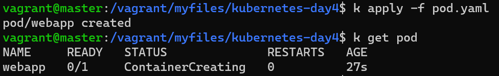
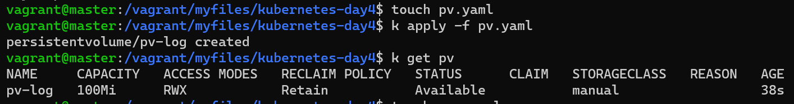
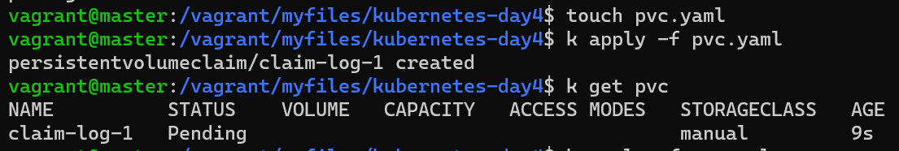
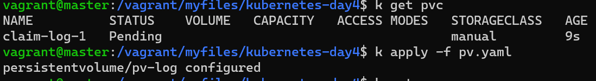
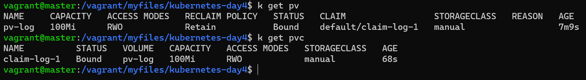

1. create pod from the below yaml file
   
    ```yaml
    apiVersion: v1
    kind: Pod
    metadata:
    name: webapp
    spec:
    containers:
    - env:
        - name: LOG_HANDLERS
        value: file
        image: kodekloud/event-simulator
        imagePullPolicy: Always
        name: event-simulator
    ```
---

2. Configure a volume to store these logs at /var/log/webapp on the host.

    Use the spec provided below.

    Name: webapp

    Image Name: kodekloud/event-simulator

    Volume HostPath: /var/log/webapp

    Volume Mount: /log

    - create a yaml file pod.yaml

        ```yaml
        apiVersion: v1
        kind: Pod
        metadata:
        name: webapp
        spec:
        containers:
        - env:
            - name: LOG_HANDLERS
            value: file
            image: kodekloud/event-simulator
            imagePullPolicy: Always
            name: event-simulator
            volumeMounts:
            - name: vol
            mountPath: /log
        volumes:
            - name: vol
            hostPath:
                path: /var/log/webapp
                type: Directory
        ```
    - apply
        ```bash
        k apply -f pod.yaml
        ```
    

---
3. Create a Persistent Volume with the given specification.

    Volume Name: pv-log

    Storage: 100Mi

    Access Modes: ReadWriteMany

    Host Path: /pv/log

    Reclaim Policy: Retain
    
    - create a yaml file pv.yaml
        ```yaml
        apiVersion: v1
        kind: PersistentVolume
        metadata:
        name: pv-log
        labels:
            type: local
        spec:
        storageClassName: manual
        capacity:
            storage: 100Mi
        accessModes:
            - ReadWriteMany
        hostPath:
            path: /pv/log
        persistentVolumeReclaimPolicy: Retain
        ```

    - apply
        ```bash
        k apply -f pv.yaml
        ```

    
---
4. Let us claim some of that storage for our application. Create a Persistent Volume Claim with the given specification.

    Volume Name: claim-log-1

    Storage Request: 50Mi

    Access Modes: ReadWriteOnce

    - create a yaml file pvc.yaml
        ```yaml
       apiVersion: v1
        kind: PersistentVolumeClaim
        metadata:
        name: claim-log-1
        spec:
        storageClassName: manual
        accessModes:
            - ReadWriteOnce
        resources:
            requests:
            storage: 50Mi
        ```

    - apply
        ```bash
        k apply -f pvc.yaml
        ```

    
---
5. What is the state of the Persistent Volume Claim? 
   Pending
---
6. What is the state of the Persistent Volume?
   Available
---
7. Why is the claim not bound to the available Persistent Volume?
   Access modes are different from each other in PV is ReadWriteMany and in PVC is ReadWriteOnce
---
8. Update the Access Mode on the claim to bind it to the PV?
    - Modify PV file
        ```yaml
        apiVersion: v1
        kind: PersistentVolume
        metadata:
        name: pv-log
        labels:
            type: local
        spec:
        storageClassName: manual
        capacity:
            storage: 100Mi
        accessModes:
            - ReadWriteOnce
        hostPath:
            path: /pv/log
        persistentVolumeReclaimPolicy: Retain
        ```
    - apply
        ```bash
        k apply -f pv.yaml
        ```

    
    
   