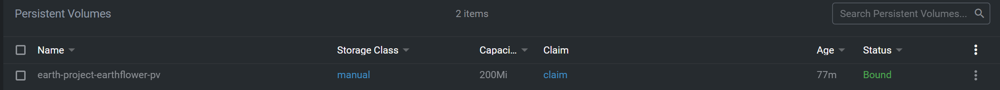

### Day5

1. The DevOps team would like to get the list of all Namespaces in the cluster. Get the list and save it to /opt/namespaces.
   ```bash
   k get ns
   ```
    - saved
    

---
2. create  ServiceAccount named neptune-sa-v2 in Namespace neptune.
   ```yaml
    apiVersion: v1
    kind: Namespace
    metadata:
        creationTimestamp: null
        name: neptune
    spec: {}
    status: {}
   ```
   - creat namespace yaml file
    

    ```yaml
    apiVersion: v1
    kind: ServiceAccount
    metadata:
        creationTimestamp: null
        name: neptune-sa-v2
        namespace: neptune
    ```
   - create Service Account
    
---
3. Create a new ConfigMap named cm-3392845. Use the spec given on the below.

    ConfigName Name: cm-3392845

    Data: DB_NAME=SQL3322

    Data: DB_HOST=sql322.mycompany.com

    Data: DB_PORT=3306
    ```yaml
    apiVersion: v1
    kind: ConfigMap
    metadata:
        creationTimestamp: null
        name: cm-3392845
        namespace: neptune
    data:
        DB_NAME: SQL3322
        DB_HOST: sql322.mycompany.com
        DB_PORT: "3306"
    ```


    - create Configmap
    
---
4. 
   - Team Pluto needs a new cluster internal Service.
   - Create a ClusterIP Service named project-plt-6cc-svc in Namespace pluto.
   - This Service should expose a single Pod named project-plt-6cc-api of image nginx:1.17.3-alpine,
   - create that Pod as well.
   - The Pod should be identified by label project: plt-6cc-api.
   - The Service should use tcp port redirection of 3333:80.
        - create pluto ns yaml file
            ```yaml
            apiVersion: v1
            kind: Namespace
            metadata:
                creationTimestamp: null
                name: pluto
            spec: {}
            status: {}
            ```

        - create pod in pluto ns yaml file
            ```yaml
            apiVersion: v1
            kind: Pod
            metadata:
                name: nginx
                namespace: pluto
            labels:
                app: plt-6cc-api
            spec:
                containers:
                - name: nginx
                    image: nginx:1.17.3-alpine
                    imagePullPolicy: IfNotPresent
                    ports:
                    - containerPort: 80
            ```
        - create service in pluto ns yaml file
            ```yaml
            apiVersion: v1
            kind: Service
            metadata:
                name: project-plt-6cc-svc
                namespace: pluto
            spec:
                type: ClusterIP
                ports:
                - name: tcp
                    port: 3333
                    protocol: TCP
                    targetPort: 80
                selector:
                    app: plt-6cc-api
            ```
        
        


---
5. 
   - Create a new PersistentVolume named earth-project-earthflower-pv. It should have a capacity of 2Gi, accessMode ReadWriteOnce, hostPath /Volumes/Data and no storageClassName defined.
   - Next create a new PersistentVolumeClaim in Namespace earth named earth-project-earthflower-pvc . It should request 2Gi storage, accessMode ReadWriteOnce and should not define a storageClassName. The PVC should bound to the PV correctly.
   - Finally create a new Deployment project-earthflower in Namespace earth which mounts that volume at /tmp/project-data. The Pods of that Deployment should be of image httpd:2.4.41-alpine.
        - creat PersistentVolume yaml file
            ```yaml
            apiVersion: v1
            kind: PersistentVolume
            metadata:
                name: earth-project-earthflower-pv
            spec:
                storageClassName: manual
                capacity:
                    storage: 200Mi
                accessModes:
                    - ReadWriteOnce
                hostPath:
                    path: /Volumes/Data
            ```

        - creat PersistentVolumeClaim yaml file
            ```yaml
            apiVersion: v1
            kind: PersistentVolumeClaim
            metadata:
                name: claim
                namespace: earth
            spec:
                storageClassName: manual
                accessModes:
                    - ReadWriteOnce
                resources:
                    requests:
                    storage: 200Mi
            ```

        - creat PersistentVolumeClaim yaml file
            ```yaml
            apiVersion: v1
            kind: PersistentVolumeClaim
            metadata:
                name: claim
                namespace: earth
            spec:
                storageClassName: manual
                accessModes:
                    - ReadWriteOnce
                resources:
                    requests:
                    storage: 200Mi
            ```

        - creat Deployment yaml file
            ```yaml
            apiVersion: apps/v1
            kind: Deployment
            metadata:
            name: project-earthflower
            namespace: earth
            labels:
                app: httpd
            spec:
            replicas: 1
            selector:
                matchLabels:
                app: httpd
            template:
                metadata:
                labels:
                    app: httpd
                spec:
                volumes:
                    - name: pv-storage
                    persistentVolumeClaim:
                        claimName: claim
                containers:
                - name: httpd
                    image: httpd:2.4.41-alpine
                    ports:
                    - containerPort: 80
                    volumeMounts:
                    - mountPath: /tmp/project-data
                    name: pv-storage
            ```
        
        
        
        
        


